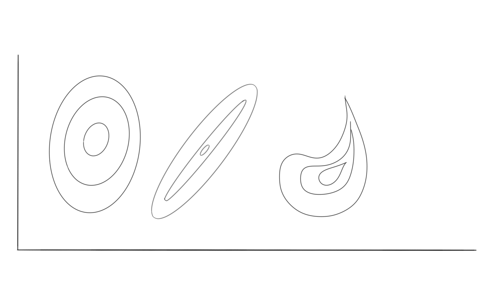

# JavaScript Confidence Ellipse Chart


This demo application belongs to the set of examples for LightningChart JS, data visualization library for JavaScript.

LightningChart JS is entirely GPU accelerated and performance optimized charting library for presenting massive amounts of data. It offers an easy way of creating sophisticated and interactive charts and adding them to your website or web application.

The demo can be used as an example or a seed project. Local execution requires the following steps:

-   Make sure that relevant version of [Node.js](https://nodejs.org/en/download/) is installed
-   Open the project folder in a terminal:

          npm install              # fetches dependencies
          npm start                # builds an application and starts the development server

-   The application is available at _http://localhost:8080_ in your browser, webpack-dev-server provides hot reload functionality.


## Description

This example shows how a _confidence ellipse_ can be drawn inside a scatter chart with LightningChart JS.

Confidence ellipses are used especially with statistic chart applications. A common usage, for example, is the 95% confidence ellipse, which visualizes the area that contains 95% of samples, which makes it easier for the user to understand which points are _outliers_.

There are various ways of defining and calculating the shape of different confidence ellipses - traditionally in 2D applications they are rotated ellipses with width and height, however in some cases they might not actually be ellipses geometrically, but more complex shapes.



LightningChart JS currently does not come with any routine for calculating a confidence ellipse shape. However, just about any kind of confidence ellipse shape can be visualized using `PolygonSeries`.

`PolygonSeries` can be used to draw any _non-complex_ polygon shape (_polygon that doesn't intersect with itself_) inside XY charts. It is configured by supplying a list of `{x: number, y: number}` coordinates.

```js
// Example, visualization of polygon inside ChartXY.
const polygonSeries = chart.addPolygonSeries()
const polygonFigure = polygonSeries.add([
    { x: 0, y: 0 },
    { x: 5, y: 10 },
    { x: 10, y: 15 },
    { x: 15, y: 5 },
    { x: 10, y: -5 },
    { x: 5, y: -2 },
])
```


## API Links

* [Lightning chart]
* [Color factory CSS]
* [2D Point shape options]
* [Solid line style]
* [Solid fill style]
* [Chart XY]
* [Point Series 2D]
* [Polygon Series 2D]


## Support

If you notice an error in the example code, please open an issue on [GitHub][0] repository of the entire example.

Official [API documentation][1] can be found on [LightningChart][2] website.

If the docs and other materials do not solve your problem as well as implementation help is needed, ask on [StackOverflow][3] (tagged lightningchart).

If you think you found a bug in the LightningChart JavaScript library, please contact sales@lightningchart.com.

Direct developer email support can be purchased through a [Support Plan][4] or by contacting sales@lightningchart.com.

[0]: https://github.com/Arction/
[1]: https://lightningchart.com/lightningchart-js-api-documentation/
[2]: https://lightningchart.com
[3]: https://stackoverflow.com/questions/tagged/lightningchart
[4]: https://lightningchart.com/support-services/

© LightningChart Ltd 2009-2022. All rights reserved.


[Lightning chart]: https://lightningchart.com/js-charts/api-documentation/v5.2.0/functions/lightningChart-1.html
[Color factory CSS]: https://lightningchart.com/js-charts/api-documentation/v5.2.0/functions/ColorCSS.html
[2D Point shape options]: https://lightningchart.com/js-charts/api-documentation/v5.2.0/enums/PointShape.html
[Solid line style]: https://lightningchart.com/js-charts/api-documentation/v5.2.0/classes/SolidLine.html
[Solid fill style]: https://lightningchart.com/js-charts/api-documentation/v5.2.0/classes/SolidFill.html
[Chart XY]: https://lightningchart.com/js-charts/api-documentation/v5.2.0/classes/ChartXY.html
[Point Series 2D]: https://lightningchart.com/js-charts/api-documentation/v5.2.0/classes/PointSeries.html
[Polygon Series 2D]: https://lightningchart.com/js-charts/api-documentation/v5.2.0/classes/PolygonSeries.html

